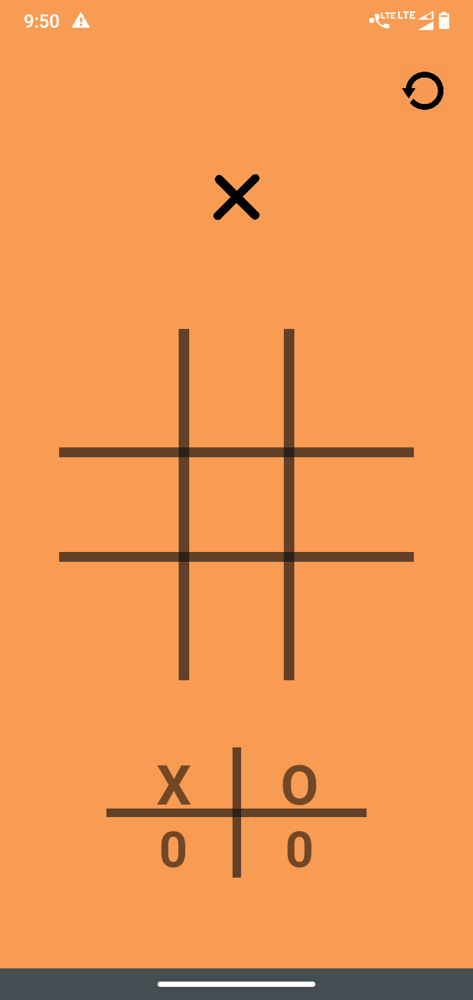
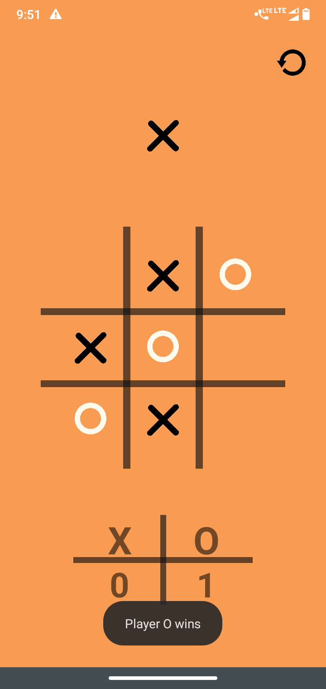
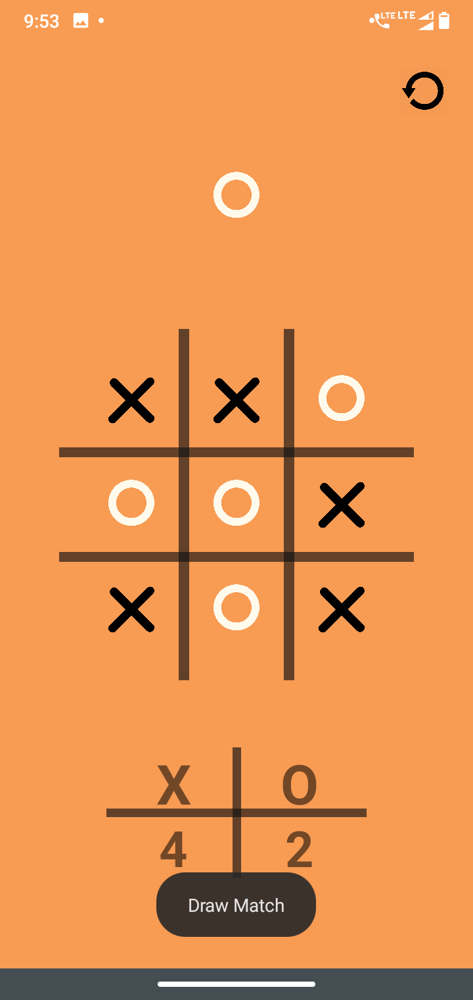

# Tic Tac Toe (T3 Board)
A simple Tic Tac Toe app for Android, developed as a college project in 2021.

## Project Description
This Android app allows two players to play Tic Tac Toe on a single device. It features:

* A simple and intuitive user interface.
* Game logic to determine the winner or a draw.
* Visual feedback for player turns and game results.
* A "Reset Game" button to start a new game.

## Screenshots
Here are some screenshots of the application:

|           Game Board            |           Win Screen            |            Win Screen            |
|:-------------------------------:|:-------------------------------:|:--------------------------------:|
|  |  |  |

## Technologies Used

* Android Studio (Java)
* Android SDK